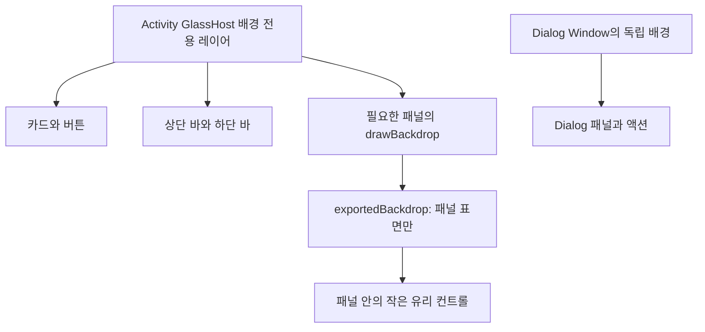

# Custom Widgets — Liquid Glass 적용 실행 계획

> 작성일: 2026-09-24 · 분석 기준: Custom Widgets `d0b0e82` · 대상 독자: 프로젝트와 Backdrop을 처음 접하는 Android 개발자
>
> 이 문서는 설계·실행·완료 기준을 담는다. 최초 분석은 구현 전 `d0b0e82`를 기준으로 했으며, 지금의 구현·빌드 상태는 아래 **구현 현황**과 `docs/liquid-glass/`의 증거 기록을 기준으로 한다. 코드 블록은 실제 구현과 명시적으로 연결하지 않는 한 설명용 예시다. 완료 체크는 코드 반영과 빌드만으로 충분하지 않은 기기 항목을 구분해 기록한다.

## 0. 먼저 읽을 결론

## 구현 현황 (2026-09-25)

초기 계획에 따라 앱 셸과 화면 컴포넌트 전환, 의존성/도구 체인 정렬이 코드에 반영됐다. 현황·파일 지도는 [implementation.md](docs/liquid-glass/implementation.md), 호환 버전은 [compatibility.md](docs/liquid-glass/compatibility.md), 실제로 끝난 확인과 미실행 항목은 [verification.md](docs/liquid-glass/verification.md)에 기록한다. 아래 체크리스트를 완료로 표시하는 최종 인수 검증은 아직 진행 중이다.

2026-09-25 후속 요청에서 제품 결정을 갱신했다. **사용자가 시각 효과 모드를 고르는 설정을 제공하지 않는다.** 각 기기에서 가능한 가장 높은 효과를 자동 적용한다. 예전 본문의 Auto/Reduced/Off 선택 UI와 저장 동작에 관한 지침은 아래 갱신된 결정으로 대체한다.

### 후속 UI 정리 TODO

- [x] Settings의 시각 효과 선택 UI, SharedPreferences 상태, 번역 리소스를 제거한다.
- [x] API31–32는 blur, API33 이상은 lens를 포함한 Full 모드로 자동 고정한다.
- [x] 창의성 슬라이더의 glass thumb와 충분한 높이의 굴절 track을 공통 컴포넌트에서 강화한다.
- [x] MCP 등록 다이얼로그의 backdrop 소스를 패널 shape 안으로 clip해 네 모서리를 일치시킨다.
- [x] 하단 NavigationBar를 시스템 하단 inset 위의 둥근 플로팅 glass bar로 바꾼다.
- [x] debug catalog·계측 테스트 코드·구현 문서에서 삭제된 모드 선택 UI 참조를 정리한다.
- [x] 테스트 실행 없이 `:app:assembleDebug`로 변경된 앱 소스를 컴파일하고 설치 APK를 생성한다.
- [ ] 최신 APK를 실제 기기에 설치해 창의성 슬라이더, MCP 등록 모서리, 플로팅 바를 눈으로 확인한다. 이 기기 확인은 사용자가 직접 진행한다.


1. **Kyant0 AndroidLiquidGlass의 배포 라이브러리인 Backdrop 2.0.1을 도입한다.** 이 라이브러리는 완성된 버튼 세트를 제공하지 않는다. 배경 캡처·흐림·굴절 기능 위에 이 앱의 공통 UI 컴포넌트를 만든다.
2. 앱이 소유한 모든 인터랙션 표면을 전환한다. 버튼, 아이콘 버튼, FAB, 선택 칩, 입력창, 스위치, 슬라이더, 탭, 카드, 상·하단 바, 삭제 확인 및 MCP 등록 다이얼로그가 포함된다.
3. **최우선 선행 작업은 빌드 호환성 확보다.** 배포된 `backdrop-android:2.0.1` AAR는 `minCompileSdk=37`을 요구한다. 현재 앱은 compileSdk 35, Kotlin 2.0.21, 오래된 Compose BOM을 사용한다. 의존성 한 줄만 추가하는 작업으로 취급하면 안 된다.
4. **배경 캡처 영역 안에 그 배경을 사용하는 유리 컴포넌트를 넣지 않는다.** 참조 앱에서 실제 수정한 RenderThread 순환 문제다. 배경 전용 형제 레이어와 전경 UI를 분리한다.
5. API 31–32는 blur 중심, API 33 이상은 blur + lens를 사용한다. 사용자 선택은 없으며 각 Android 버전에서 가능한 가장 강한 지원 효과를 사용한다. minSdk보다 낮은 버전과 Preview에서는 안전한 불투명 fallback을 쓴다.
6. 앱 내 위젯 미리보기의 **외곽 UI**는 전환한다. 사용자가 만든 DSL의 실제 내용과 홈 화면 Glance 위젯에는 Compose Backdrop을 직접 주입하지 않는다. 두 렌더러의 결과 일치를 보존한다.
7. 단계별로 도구 체인 → 독립 샘플 → 디자인 시스템 → 화면 → 모달 → 접근성·성능 검증을 진행한다. 전체 화면을 한 번에 교체하지 않는다.

### 읽는 순서

- 처음 구현: 1~5장으로 구조와 위험을 이해하고, 6~9장으로 공통 컴포넌트를 만든 뒤 10장 화면별 작업을 진행한다.
- 코드 리뷰: 3장의 참조 실패, 7장의 렌더링 규칙, 12장의 검증 표, 15장의 완료 기준을 먼저 확인한다.
- 장애 대응: 13장 문제 해결 표와 14장 롤백 절차를 사용한다.
- 프로젝트 기능 이해: [PROJECT.md](PROJECT.md), 기존 기능상 문제: [PROBLEM.md](PROBLEM.md). 이번 디자인 변경을 기존 기능 버그 수정의 완료 증거로 취급하지 않는다.

## 1. 범위와 제품 결정

### 1.1 적용 범위

| 영역 | 적용 방법 | 완료 기준 |
|---|---|---|
| 앱 버튼 전체 | 공통 GlassButton/GlassIconButton/FAB | 기본·눌림·비활성·로딩 상태가 일관됨 |
| 팝업·다이얼로그 | 별도 Window 안에 자체 GlassHost를 둠 | 배경·패널·입력·액션이 동일 언어이며 Back/IME 정상 |
| 선택 UI | GlassFilterChip, GlassSelectableCard, GlassSwitch | 선택 상태가 색·형태·semantics에 반영됨 |
| 슬라이더 | Material Slider 동작을 유지하고 트랙·엄지를 유리 표면으로 교체 | 드래그, 접근성 증감, 값 범위 보존 |
| 화면 구성 | GlassCard, GlassTopBar, GlassNavigationBar | 불투명 기본 컨테이너가 효과를 가리지 않음 |
| 로딩·오류·빈 상태 | 유리 패널 + 읽기 쉬운 상태 텍스트 | 기존 재시도·취소·생성 행동 유지 |
| 위젯 미리보기 | 프레임·도구·편집 액션에 적용 | DSL 캔버스 안의 색·모양·버튼은 정의대로 표시 |
| 홈 화면 위젯 | 이번 Backdrop 전환의 기술적 예외 | Glance 렌더러와 사용자 데이터 보존 |
| Android 시스템 UI | 앱이 제어하는 시스템 바 대비만 조정 | 시스템 권한창·키보드·런처 UI를 앱이 재구현하지 않음 |

여기서 “다이얼 등등”은 기존 다이얼로그 및 값 조절 UI까지 포괄하는 요청으로 해석한다. 현재 소스에는 회전식 다이얼, DropdownMenu, BottomSheet가 없다. 없는 제품 기능을 새로 추가하지 않고, 향후 도입 시 따라야 할 Popup/Sheet 규칙을 9장에 제공한다.

### 1.2 시각적 방향

- 기존 `CustomWidgetsTheme`의 동적 색상과 타이포그래피를 유지하고 그 위에 유리 재질을 얹는다.
- 바탕은 밝은 중성색 또는 어두운 중성색, 주요 액션과 선택 상태는 `colorScheme.primary`, 파괴적 액션은 `error` 계열로 표현한다.
- 배경에 완만한 색 변화가 있어야 굴절이 보인다. 정적인 그라데이션과 소수의 넓은 색 면을 사용한다. 매 프레임 움직이는 배경은 기본값으로 넣지 않는다.
- 모든 요소가 동일 강도로 굴절될 필요는 없다. 외곽 카드·바·다이얼로그가 재질을 만들고, 작은 내부 액션은 약한 blur 또는 톤·윤곽선으로 동일 언어를 유지한다.
- 효과 강도는 사용자가 변경할 수 없다. API31–32는 blur, API33 이상은 lens를 포함한 Full 효과를 자동 선택하고 그 외 환경만 안전하게 fallback한다.
- 텍스트 자체를 흐리거나 굴절시키지 않는다. Backdrop을 그린 다음 텍스트와 아이콘을 선명한 전경으로 그린다.

### 1.3 Glance 경계

`widget/renderer/DslRenderer.kt`는 Glance용이고 `ui/preview/ComposeWidgetPreview.kt`는 앱 내 Compose 미리보기용이다. Glance는 Compose runtime을 사용하지만 일반 Compose UI와 직접 섞을 수 없다. 따라서 `Modifier.drawBackdrop`을 `GlanceModifier`에 붙이는 구현은 성립하지 않는다. [Android Glance 공식 문서](https://developer.android.com/develop/ui/compose/glance)

홈 위젯에도 유사한 외관이 필요해지면 별도 작업으로 DSL에 반투명 배경·둥근 모서리·정적 이미지 재질을 정의하고 양쪽 렌더러를 함께 수정한다. 그것은 런처 배경의 실시간 굴절과 다르다. 현재 계획에서는 사용자 DSL을 임의로 바꾸지 않는다.

## 2. 확인한 소스와 재현 기준

### 2.1 외부 자료

| ID | 자료 | 이번 계획에 반영한 내용 |
|---|---|---|
| S1 | [AndroidLiquidGlass](https://github.com/Kyant0/AndroidLiquidGlass) | 라이브러리 이름·아티팩트·컴포넌트 제공 범위 |
| S2 | [확인 시점 upstream 소스](https://github.com/Kyant0/AndroidLiquidGlass/tree/65ab177e90e5c1d8c62e70cf7755841982da65f6) | 움직이는 `kmp` 브랜치와 구분한 참고 스냅샷 |
| S3 | [Backdrop 2.0.1 POM](https://repo.maven.apache.org/maven2/io/github/kyant0/backdrop/2.0.1/backdrop-2.0.1.pom) | Kotlin 2.4.10, Compose 1.12.0, Shapes 1.2.1 의존성 |
| S4 | [Android AAR](https://repo.maven.apache.org/maven2/io/github/kyant0/backdrop-android/2.0.1/backdrop-android-2.0.1.aar) · [배포 소스 JAR](https://repo.maven.apache.org/maven2/io/github/kyant0/backdrop-android/2.0.1/backdrop-android-2.0.1-sources.jar) | 실제 minCompileSdk와 drawBackdrop/lens 시그니처 확인 |
| S5 | [Backdrops API](https://kyant.gitbook.io/backdrop/api/backdrops) · [Effects API](https://kyant.gitbook.io/backdrop/api/backdrop-effects) | 배경 소스 종류, 효과 순서, 지원 API |
| S6 | [Glass Bottom Sheet](https://kyant.gitbook.io/backdrop/tutorials/glass-bottom-sheet) | glass-on-glass 순환과 exportedBackdrop 해법 |
| S7 | [LiquidButton 예제](https://github.com/Kyant0/AndroidLiquidGlass/blob/65ab177e90e5c1d8c62e70cf7755841982da65f6/app/src/commonMain/kotlin/com/kyant/backdrop/catalog/components/LiquidButton.kt) | Capsule, 효과와 상호작용 구성 방식 |
| S8 | [LiquidToggle](https://github.com/Kyant0/AndroidLiquidGlass/blob/65ab177e90e5c1d8c62e70cf7755841982da65f6/app/src/commonMain/kotlin/com/kyant/backdrop/catalog/components/LiquidToggle.kt) · [LiquidSlider](https://github.com/Kyant0/AndroidLiquidGlass/blob/65ab177e90e5c1d8c62e70cf7755841982da65f6/app/src/commonMain/kotlin/com/kyant/backdrop/catalog/components/LiquidSlider.kt) | 커스텀 토글·슬라이더 구현 참고; 접근성은 앱에서 별도 보장 |
| S9 | [AGP built-in Kotlin 전환](https://developer.android.com/build/migrate-to-built-in-kotlin) | AGP 9 전환 시 kotlin-android 및 compilerOptions 처리 |

라이브 문서·upstream HEAD와 Maven 2.0.1은 같은 소스라고 가정하지 않는다. 시그니처 판단은 **선택한 배포 소스 JAR**를 우선한다. 예를 들어 2.0.1 `lens`의 `refractionAmount`는 호출 시 전달해야 한다. 위 문서 링크의 최신 예시와 다르면 배포 코드에 맞춘다.

### 2.2 로컬 기준

- 현재 프로젝트: `/root/custom-widgets`, 분석 HEAD `d0b0e82`.
- 참고 프로젝트: `/root/auto-band-selector`, 조사 시 현재 HEAD `163d22d`. 다음 세 커밋을 각각 `git show`로 확인했다. HEAD 전체를 그 세 커밋과 동일시하지 않는다.
- 아래 파일 위치의 숫자는 분석 시점의 탐색용 행 번호다. 변경 후에는 행 번호보다 파일명·함수명을 우선한다.

## 3. auto-band-selector의 시행착오를 어떻게 반영하는가

### 3.1 도구 체인 정렬 — ca24c184

[커밋과 지정한 diff](https://github.com/sleepysoong/auto-band-selector/commit/ca24c18462acdfd39a7d911dbe33a7bcaf190081#diff-6513578def9fec8123411bebfe9cebc3f1bdecc9204d9277b677c9cd725d4307)

이 커밋은 AGP 9.3.2, Gradle 9.7.1, Kotlin/Compose compiler 2.4.10, Compose 1.12.0, compileSdk/buildTools 37, Activity Compose 1.13.0, Backdrop 2.0.1로 정렬하고 debug 전용 `BackdropSampleActivity`를 추가한다.

**채택:** 본 화면보다 샘플을 먼저 만든다. SDK·플러그인·Compose 런타임을 한 묶음으로 확인한다. 앱을 KMP 프로젝트로 바꾸지 않는다.

**이 프로젝트에서 추가할 것:** 여기에는 Hilt, KSP, Room, Navigation, Glance, WorkManager가 있다. 참조 앱의 Gradle 파일을 통째로 복사해도 이들 호환성이 보장되지 않는다. 5장의 호환성 게이트를 반드시 통과한다.

### 3.2 디자인 적용 — b82f6818

[디자인 적용 커밋](https://github.com/sleepysoong/auto-band-selector/commit/b82f681868bd8ac60fc87e11995bbf5e7d67a8bb)

`ui/GlassTheme.kt`, `ui/BandSelectorScreen.kt`, `DESIGN.md`에서 중성 배경, 28dp 카드, pill 버튼, 48dp 터치 영역, API별 효과 분기, 600dp 기준 레이아웃을 확인했다.

**채택:** 토큰과 컴포넌트 분리, API별 효과 분기, 접힘/펼침 공통 디자인을 사용한다.

**그대로 복사하지 않을 부분:**

- 참조 코드의 일부 blur/lens 수치는 raw px다. 이 앱에서는 Dp 토큰을 DrawScope 안에서 px로 변환한다.
- 글꼴 Pretendard와 amber 포인트는 참조 앱의 제품 결정이다. 본 앱은 기존 Typography와 동적 테마를 기준으로 한다.
- 역할만 지정한 커스텀 선택 컨트롤로 끝내지 않는다. `selected`, `checked`, disabled, 값 변경 semantics도 제공한다.
- 예제의 눌림 제스처 코드를 복사할 때 스크롤·드래그·접근성 클릭과 충돌하는지 확인한다. 첫 버전에서는 Material 동작을 재사용한다.

### 3.3 시작 시 렌더링 순환 수정 — 6aa9ae9c

[순환 수정 커밋](https://github.com/sleepysoong/auto-band-selector/commit/6aa9ae9c418d91e0c5979dc98faa196842b26dec)

문제를 설명하기 위해 축약한 구조:

```kotlin
// 금지: 이 Box가 기록하는 content에 같은 backdrop의 소비자가 포함된다.
Box(Modifier.layerBackdrop(backdrop)) {
    GlassCard(backdrop = backdrop) { /* ... */ }
}
```

수정의 핵심:

```kotlin
Box(Modifier.fillMaxSize()) {
    // 이 소스는 배경만 포함한다.
    Box(Modifier.matchParentSize().layerBackdrop(backdrop).background(baseColor))
    // 같은 backdrop을 읽는 컴포넌트는 위 Box의 자식이 아닌 형제다.
    ScreenControls(backdrop)
}
```

이 커밋은 `StartupRenderingTest.kt`에 시작 → `captureToImage()` → Activity recreate → 다시 캡처하는 계측 테스트도 추가했다. Activity 생성 성공만으로 GPU 렌더링 성공을 판단하지 않는 접근을 채택한다.

**증거의 한계:** 해당 커밋의 PROJECT.md에는 설치된 debug APK의 실기기 크래시 해결을 추가 확인해야 한다고 적혀 있다. 수정 코드와 테스트 추가는 확인했지만 모든 기기에서 해결됐다고 해석하지 않는다. 본 앱에서 별도 실기기 검증을 수행한다.

## 4. 현재 프로젝트 변경 지점 지도

이하 경로는 특별한 언급이 없으면 `app/src/main/kotlin/com/customwidgets/app/` 기준이다.

### 4.1 기반 구조

| 파일/위치 | 현재 상태 | 필요한 변경 |
|---|---|---|
| `gradle/libs.versions.toml` | `kyantBackdrop=2.0.0`, `kyantShapes=1.2.0` 문자열만 존재 | 실제 library alias 추가, 검증한 버전으로 정렬 |
| `app/build.gradle.kts` | Backdrop 의존성 없음, AAR metadata 작업 비활성화 | 의존성 추가, 검사 복원, 호환성 문제 해결 |
| `ui/theme/LiquidGlassComponents.kt` | gradient/border 기반 미사용 유리 유틸 | 새 `ui/glass`로 대체 후 중복 제거 |
| `ui/theme/Theme.kt` | Material3 + dynamicColor 기본 true | MaterialTheme 안에서 Glass 토큰 공급 |
| `MainActivity.kt` 약 80~100행 | 루트 Scaffold, 4개 NavigationBarItem | 전체 GlassHost, 투명 Scaffold, 유리 하단 바 |
| `ui/configure/WidgetConfigureActivity.kt` | 별도 Activity에서 CreateWidgetScreen 직접 실행 | 독립 GlassHost 추가, 위젯 결과 전달 유지 |
| `util/FoldableUtils.kt` | 600/840dp 크기 분기 | 기존 분기 유지, 크기 변경 시 배경/패널 재측정 |

기존 `SquircleShape`는 `Shape`를 직접 구현하고 `Outline.Generic`을 반환한다. 이름과 달리 원형 코너의 RoundRect를 Path에 넣는다. 2.0.1 lens는 인식 가능한 코너 구조가 필요하므로 이 타입을 그대로 lens에 넘기지 않는다. 배포 소스는 `CornerBasedShape`와 Kyant `RoundedRectangularShape` 등을 처리한다. 1차 구현은 `RoundedCornerShape`, 고급 연속 곡률은 Shapes 1.2.1의 `RoundedRectangle`/`Capsule`을 사용한다.

### 4.2 화면별 전수 목록

| 화면/파일 | 기존 요소와 탐색 행 | 대체 컴포넌트 |
|---|---|---|
| Gallery: `ui/gallery/WidgetGalleryScreen.kt` | TopAppBar 74, MCP/설정 아이콘 82/85, ExtendedFAB 95 | GlassTopBar, GlassIconButton, GlassExtendedFab |
| 같은 파일 | 삭제 AlertDialog 134, 확인/취소 139/149 | GlassDialog, destructive/secondary GlassButton |
| 같은 파일 | `ExpressiveWidgetCard` 159, ElevatedCard 172, badge Surface 185, 삭제 아이콘 229 | GlassCard, GlassBadge, GlassIconButton |
| 같은 파일 | `EmptyExpressiveState` 242, OutlinedCard 250, 생성 버튼 276 | GlassEmptyState, GlassButton |
| Create: `ui/create/CreateWidgetScreen.kt` | TopAppBar 96, 뒤로 99 | GlassTopBar, GlassIconButton |
| 같은 파일 / `FoldableDualPaneWizard` 173 | 패널 186/277, 입력 208/251, chip 228, 생성 238, 저장 261, surface 309/326 | GlassCard, GlassTextField, GlassFilterChip, GlassButton, GlassStatus |
| 같은 파일 / `SizeSelectionStep` 354 | 크기 카드 376 | GlassSelectableCard |
| 같은 파일 / `DescriptionStep` 409 | chip 437, 입력 447, 뒤로 464, 생성 467 | GlassFilterChip, GlassTextField, GlassButton |
| 같은 파일 / `GenerationAndPreviewStep` 481 | 상태 515, 오류 카드 533, 재생성 553, preview 565 | GlassStatus, GlassCard, GlassButton, PreviewFrame |
| 같은 파일 | 이름 580, 편집/액션 594/601, JSON 612, 적용 626, 뒤로/저장 638/641 | GlassTextField, GlassButton |
| 같은 파일 / `SaveConfirmationStep` 654 | 성공 카드 665, 완료 698 | GlassCard, GlassButton |
| Detail: `ui/gallery/WidgetDetailScreen.kt` | bar/back 72/75, 카드 109/133/152 | GlassTopBar, GlassIconButton, GlassCard |
| 같은 파일 | JSON 157, 취소/저장 175/182, 편집 205 | GlassTextField, GlassButton |
| Settings: `ui/settings/ApiSettingsScreen.kt` | bar/back 69/72, 설명 90, 외부 링크 110, 설정 카드 124 | GlassTopBar, GlassCard, GlassTextAction |
| 같은 파일 | API Key 139, 표시 전환 145, model chip 165, temperature Slider 187, tokens 196 | GlassTextField, GlassIconButton, GlassFilterChip, GlassSlider |
| 같은 파일 | 연결 상태 215, 연결 테스트/저장 243/256 | GlassStatus, GlassButton |
| MCP: `ui/mcp/McpServerScreen.kt` | bar/back 67/70, FAB 80, 상태 104 | GlassTopBar, GlassIconButton, GlassFab, GlassStatus |
| 같은 파일 | 추가 AlertDialog 143, 이름/URL/key 148/154/161, 등록/취소 170/183 | GlassDialog, GlassTextField, GlassButton |
| 같은 파일 / `McpServerCard` 192 | 카드 202, Switch 224, 세부/테스트/삭제 237/249/256, 도구 badge 265 | GlassCard, GlassSwitch, GlassButton, GlassBadge |
| 같은 파일 / `EmptyMcpState` 295 | 서버 추가 318 | GlassEmptyState, GlassButton |

소스 검색으로 누락을 확인하되 DSL 미리보기의 `Button`을 앱 액션과 구분한다:

```bash
rg -n 'Button\(|IconButton\(|FloatingActionButton\(|FilterChip\(|Switch\(|Slider\(|AlertDialog\(|DropdownMenu\(|Popup\(|ModalBottomSheet\(|Surface\(|Card\(|TextField\(' app/src/main/kotlin/com/customwidgets/app
```

작업 완료 시 검색 결과가 0일 필요는 없다. `ui/glass` 내부의 Material 구현과 DSL 렌더러는 허용한다. 각 화면에 남은 직접 Material 호출은 의도와 예외를 기록한다.

## 5. 단계 0 — 의존성·빌드 호환성 게이트

### 5.1 확인된 사실과 미확정 항목

| 항목 | 현재 앱 | 이번 작업의 기준 | 확정 수준 |
|---|---|---|---|
| Backdrop | 연결 안 됨 | 2.0.1 고정 | Maven 배포 확인 |
| Shapes | 연결 안 됨 | 1.2.1 | Backdrop 배포 의존성 확인 |
| compileSdk | 35 | 37 | AAR의 minCompileSdk=37 직접 확인 |
| minSdk | 31 | 31 유지 | API 분기로 대응 |
| targetSdk | 35 | 디자인 작업에서는 35 유지 | compileSdk와 별개; 정책상 변경은 별도 판단 |
| Kotlin / Compose compiler | 2.0.21 | 2.4.10 기준 | 참조 앱·배포 POM 기준 |
| Compose foundation/ui/graphics | BOM 2024.10.01 | 배포 의존성 1.12.0과 정렬 | 최종 resolved Android 좌표 확인 필요 |
| AGP / Gradle | 8.5.2 / 8.9 | 참조 조합 9.3.2 / 9.7.1을 우선 평가 | 본 앱 전체 호환은 미검증 |
| Java bytecode | 17 | 17 유지 | Gradle 실행 JDK 요구는 선택한 도구 체인에서 별도 확인 |
| Activity Compose | 1.9.3 | 참조 조합 1.13.0 우선 평가 | 앱 계측까지 확인 |
| KSP | 2.0.21-1.0.28 | Kotlin 2.4/AGP 9 지원 릴리스 선택 | 버전 확정 전 선행 작업 |
| Hilt / Hilt Work | 2.51.1 / 1.2.0 | AGP 9·KSP와 호환되는 조합 선택 | 버전 확정 전 선행 작업 |
| Room | 2.6.1 | 선택 KSP에서 코드 생성 확인 | 필요 시 호환 릴리스로 변경 |
| Material3 / Navigation / Glance | BOM / 2.8.4 / 1.1.1 | 선택 Compose에서 컴파일·동작 확인 | 자동 호환을 가정하지 않음 |

**미확정 버전을 숫자로 꾸며 넣지 않는다.** 이 계획의 첫 구현 산출물은 이 표의 마지막 열을 실제 resolved 버전과 빌드 증거로 채운 `docs/liquid-glass/compatibility.md`다. 이를 끝내기 전에는 화면 전환 작업에 들어가지 않는다. 참조 앱에 없던 코드 생성 플러그인까지 문서 조사만으로 호환된다고 단정할 수 없기 때문이다.

### 5.2 실행 순서

1. 작업 브랜치를 만든다. 제안 이름: `codex/liquid-glass-foundation`. 기존 작업 파일이 있으면 보존한다.
2. 현재 wrapper/JDK/SDK 및 기존 빌드 상태를 기록한다. 기존 실패는 [PROBLEM.md](PROBLEM.md)의 항목과 함께 분리한다.
3. SDK 37을 설치하고 AGP/Gradle/Kotlin을 위 기준으로 전환한다. wrapper 파일과 배포 checksum을 함께 갱신한다. 참조 프로젝트의 checksum을 다른 배포 ZIP에 재사용하지 않는다.
4. AGP 9 built-in Kotlin을 사용하면 app과 root의 불필요한 `kotlin.android` 플러그인을 제거한다. Compose compiler와 serialization 플러그인은 계속 필요하며 Kotlin 버전을 맞춘다. `android.kotlinOptions`는 공식 가이드에 따라 `kotlin.compilerOptions`로 옮긴다. [공식 전환 지침](https://developer.android.com/build/migrate-to-built-in-kotlin)
5. KSP/Hilt 공식 릴리스의 AGP 9·Kotlin 지원 여부를 확인한 뒤 버전을 고정한다. 오류가 나면 해당 플러그인부터 원인을 좁힌다. 데이터 모델이나 DI 사용처를 대량 변경해서 덮지 않는다.
6. compileSdk를 37로 올린다. buildTools는 AGP 기본 선택을 우선하고 명시할 경우 참조 조합 37.0.0 및 설치 여부를 기록한다.
7. 아래 Backdrop/Shapes alias를 연결한다. 기존 `kyantBackdrop`, `kyantShapes` 버전 키를 갱신하며 중복 키를 만들지 않는다.
8. 오래된 Compose BOM과 새 JetBrains Compose 의존성이 어떻게 해석되는지 확인한다. 최종 Android 아티팩트별 버전·선택 이유를 기록한다. **BOM 버전 문자열을 `1.12.0`으로 바꾸면 안 된다.** BOM과 개별 모듈은 버전 체계가 다르다.
9. Material3, icons, tooling, ui-test, Navigation, Glance와 runtime/ui/graphics가 충돌하지 않는지 확인한다. 공식 BOM 매핑 또는 명시 버전 전략 하나를 채택하고 근거를 기록한다. 무조건 `force`나 transitive exclusion을 넣지 않는다.
10. AAR metadata 검사 비활성화 코드를 제거하고 검사 자체를 통과시킨다. 기존 lint 전체 비활성화도 신규 작업의 성공 기준으로 사용하지 않는다. 기존 위반은 명시적 baseline/별도 이슈로 관리한다.
11. Hilt 컴포넌트·Room DAO 생성과 실제 앱 컴파일이 성공하면 독립 샘플을 만든다.

의존성 연결 예시 — 도구 체인 전체 변경을 대신하는 완성 패치가 아니다:

```toml
# gradle/libs.versions.toml
[versions]
kyantBackdrop = "2.0.1"
kyantShapes = "1.2.1"

[libraries]
kyant-backdrop = { module = "io.github.kyant0:backdrop", version.ref = "kyantBackdrop" }
kyant-shapes = { module = "io.github.kyant0:shapes", version.ref = "kyantShapes" }
```

```kotlin
// app/build.gradle.kts / dependencies
implementation(libs.kyant.backdrop)
implementation(libs.kyant.shapes) // 앱 코드에서 Shapes API를 직접 사용할 때 명시
```

삭제 대상인 현재 코드:

```kotlin
tasks.configureEach {
    if (name.contains("AarMetadata")) {
        enabled = false
    }
}
```

구현자가 수행할 진단 명령 예시:

```bash
./gradlew --version
./gradlew :app:dependencies --configuration debugRuntimeClasspath
./gradlew :app:dependencyInsight --dependency compose-ui --configuration debugRuntimeClasspath
./gradlew :app:dependencyInsight --dependency kotlin-stdlib --configuration debugRuntimeClasspath
./gradlew :app:checkDebugAarMetadata
./gradlew :app:kspDebugKotlin :app:compileDebugKotlin :app:assembleDebug
```

`dependencyInsight`에 결과가 없으면 dependency 보고서의 정확한 모듈명, 예를 들어 `ui-android`, `runtime`, `foundation`으로 다시 조회한다. CI도 동일 wrapper와 JDK/SDK를 사용하도록 맞춘다.

### 5.3 통과 조건과 중단 조건

- [ ] KSP·Hilt·Room 코드 생성 성공, AAR 검사 활성 상태에서 통과.
- [ ] debug APK 생성 및 설치, 기존 앱 진입 가능.
- [ ] resolved 의존성 표와 Gradle/JDK/SDK 환경을 저장.
- [ ] Glance 위젯 생성 및 기존 위젯 갱신 smoke 확인.
- [ ] release variant 컴파일도 확인; 외부 배포·서명 키 변경은 별개.

KSP/Hilt가 선택 조합을 지원하지 않으면 이 단계에서 호환 릴리스 또는 검증 가능한 대체 도구 체인을 결정한다. 해결되지 않은 상태에서 metadata/Kotlin 검사를 끄거나 오래된 Backdrop 버전으로 몰래 내려 전체 구현을 진행하지 않는다. 대체 버전 채택 시 AAR·소스·효과 API를 다시 확인하고 문서의 기준 버전을 갱신한다.

## 6. 단계 1 — 독립 샘플과 디자인 토큰

### 6.1 debug 전용 렌더링 샘플

새 파일 제안:

```text
app/src/debug/AndroidManifest.xml
app/src/debug/kotlin/com/customwidgets/app/qa/GlassCatalogActivity.kt
app/src/debug/kotlin/com/customwidgets/app/qa/GlassCatalogScreen.kt
```

Manifest에는 debug Activity만 등록한다. 수동 실행은 debug 진입 메뉴 또는 명시적 Intent로 제공한다. release manifest에는 포함하지 않는다.

샘플은 네트워크·Hilt ViewModel·위젯 데이터에 의존하지 않게 만든다. 체크무늬/선형 그라데이션 배경 위에 카드 하나, 버튼 하나, 입력창 하나를 놓는다. API31/32 fallback과 API33 이상 Full, light/dark, 1배/2배 글꼴, dialog 열기, recreate를 확인할 수 있게 한다. 실제 앱의 조용한 배경에 앞서 패턴 배경을 쓰는 이유는 흐림과 굴절의 존재를 눈으로 판별하기 쉽기 때문이다.

### 6.2 제안 파일 구조

```text
ui/glass/
  GlassTokens.kt          # Dp·색·상태 토큰
  GlassPolicy.kt          # Android API capability 기반 최상 효과 정책
  GlassHost.kt            # 배경 소스 수명, CompositionLocal
  GlassSurface.kt         # drawBackdrop와 불투명 fallback 한 곳에서 구현
  GlassButton.kt          # 버튼·아이콘·텍스트 액션·FAB
  GlassSelection.kt       # chip·선택 카드·switch
  GlassSlider.kt          # 값/접근성은 Material 동작 재사용
  GlassTextField.kt       # label·IME·오류·비밀번호 보존
  GlassBars.kt            # top bar·navigation bar
  GlassDialog.kt         # 별도 Window와 로컬 배경
  GlassStatus.kt          # 상태·오류·빈 화면·badge
```

Popup/Sheet는 실제 사용처가 생길 때 `GlassPopup.kt`, `GlassSheet.kt`를 추가한다. 현재 단계에서는 불필요한 라이브러리 규모의 추상화를 만들지 않는다. 화면 코드가 Backdrop 라이브러리의 상세 API를 직접 다루지 않도록 `ui/glass`를 경계로 삼는다.

### 6.3 초기 토큰 — 실기기 조정의 출발점

| 토큰 | 초기값 | 의미/제약 |
|---|---|---|
| cardRadius | 28dp | 일반 카드·패널 |
| dialogRadius | 28dp | 카드와 통일; 좁은 창에서도 유지 |
| fieldRadius | 16dp | 입력창 |
| buttonShape | capsule 또는 24dp corner | 최소 높이 48dp |
| touchMin | 48dp | 시각 요소가 작아도 터치 영역 보장 |
| cardBlur | 8dp | 화면별 임의 숫자 대신 공통 토큰 |
| controlBlur | 4dp | 버튼·chip; 내부 작은 액션은 더 낮출 수 있음 |
| cardLensHeight/Amount | 12dp / 16dp | 측정한 corner와 minDimension 이내로 제한 |
| controlLensHeight/Amount | 8dp / 12dp | 48dp 컨트롤 기준 초기값 |
| background | light: #F7F7F9, dark: #0B0B0D | 동적 primary를 낮은 강도로 섞을 수 있음 |
| surfaceTint | light: 흰색 0.60, dark: #202024 0.65 | 대비 측정 후 조정; 확정 디자인 수치 아님 |
| outline | light: 검정 0.10, dark: 흰색 0.18 | 1dp, 상태별 구분 |
| primaryTint | colorScheme.primary 기반 | 글자 대비를 먼저 확보; 필요하면 불투명에 가깝게 |
| disabled | 낮춘 강조 + 불투명 배경 | 전체 alpha만 내려 읽을 수 없게 만들지 않음 |
| animation | 120~180ms 상태 변화 | 과도한 확대·흔들림 기본 제외 |

lens의 refractionHeight는 실제 최소 corner radius 이하, refractionAmount는 크기의 짧은 변 이하로 제한한다. 타원/작은 thumb처럼 형태가 달라지면 동일 수치를 무조건 재사용하지 않는다. [효과 API](https://kyant.gitbook.io/backdrop/api/backdrop-effects)

### 6.4 효과 정책

```kotlin
// 구현 예시: GlassTheme.kt — 사용자 선택 없이 Android API의 최대 지원 효과를 사용한다.
enum class GlassMode { Full, BlurOnly, Off }

fun resolveGlassMode(sdkInt: Int): GlassMode = when {
    sdkInt < 31 -> GlassMode.Off
    sdkInt < 33 -> GlassMode.BlurOnly
    else -> GlassMode.Full
}
```

앱 minSdk는 31이므로 실제 설치 대상에서는 blur 이상의 glass가 항상 켜진다. API31–32는 lens를 사용할 수 없어 BlurOnly이고, API33 이상은 Full이다. Off는 preview 등 Backdrop을 그릴 수 없는 개발 환경과 minSdk 아래 버전의 안전 fallback에만 쓴다. 사용자가 강도를 고르거나 저장하는 설정·SharedPreferences 상태는 만들지 않는다.

모션은 Material 컴포넌트의 기본 동작을 유지한다. 시스템의 접근성 모션 축소 의도를 읽는 API를 실제로 확인하기 전에는 별도 애니메이션 정책을 추가하지 않는다.

## 7. 단계 2 — 렌더링 구조와 구현 예시

### 7.1 배경의 단방향 관계



화살표는 배경 소스에서 그 배경을 읽는 소비자로 향한다. 어떤 경로도 출발점으로 돌아오지 않는다. Activity의 NavHost 전체를 A로 기록하면 그 안에 B/C/D가 포함되어 순환할 수 있으므로 금지한다.

### 7.2 최소 GlassHost

아래는 출발점이 되는 독립 예시다. 실제 구현에서는 배경 브러시를 `GlassTokens`에서 공급하고 Off일 때 불필요한 캡처를 생략한다. `backdrop`은 ViewModel, singleton, 저장 상태에 보관하지 않는다. 현재 Composition과 Window 수명을 따른다.

```kotlin
package com.customwidgets.app.ui.glass

import androidx.compose.foundation.background
import androidx.compose.foundation.layout.Box
import androidx.compose.foundation.layout.BoxScope
import androidx.compose.foundation.layout.fillMaxSize
import androidx.compose.runtime.Composable
import androidx.compose.runtime.CompositionLocalProvider
import androidx.compose.runtime.staticCompositionLocalOf
import androidx.compose.ui.Modifier
import androidx.compose.ui.graphics.Brush
import androidx.compose.ui.graphics.Color
import com.kyant.backdrop.Backdrop
import com.kyant.backdrop.backdrops.layerBackdrop
import com.kyant.backdrop.backdrops.rememberLayerBackdrop

val LocalGlassBackdrop = staticCompositionLocalOf<Backdrop?> { null }

@Composable
fun GlassHost(
    backgroundColors: List<Color>,
    modifier: Modifier = Modifier,
    content: @Composable BoxScope.() -> Unit
) {
    val backdrop = rememberLayerBackdrop()
    Box(modifier.fillMaxSize()) {
        Box(
            Modifier.matchParentSize()
                .layerBackdrop(backdrop)
                .background(Brush.linearGradient(backgroundColors))
        )
        CompositionLocalProvider(LocalGlassBackdrop provides backdrop) {
            content()
        }
    }
}
```

이 예시는 `layerBackdrop` 뒤에 background가 있으므로 그 background가 캡처 내용에 들어간다. 앞에 불투명 화면을 덮으면 캡처가 정상이어도 유리 효과가 보이지 않을 수 있다. source 크기가 0이 되지 않도록 host가 화면 크기를 확보해야 한다.

### 7.3 최소 GlassSurface

초기 버전에서 안전하게 시작할 수 있는 예시다. 코너는 RoundRect로 제한하고 highlight 기본값을 사용한다. 실제 제품에서는 role별 토큰·상태·접근성 텍스트 색을 확장한다.

```kotlin
package com.customwidgets.app.ui.glass

import androidx.compose.foundation.background
import androidx.compose.foundation.border
import androidx.compose.foundation.layout.Box
import androidx.compose.foundation.layout.BoxScope
import androidx.compose.foundation.shape.RoundedCornerShape
import androidx.compose.runtime.Composable
import androidx.compose.ui.Modifier
import androidx.compose.ui.draw.clip
import androidx.compose.ui.graphics.Color
import androidx.compose.ui.unit.Dp
import androidx.compose.ui.unit.dp
import com.kyant.backdrop.drawBackdrop
import com.kyant.backdrop.effects.blur
import com.kyant.backdrop.effects.colorControls
import com.kyant.backdrop.effects.lens

@Composable
fun GlassSurface(
    mode: GlassMode,
    tint: Color,
    opaqueColor: Color,
    outlineColor: Color,
    modifier: Modifier = Modifier,
    corner: Dp = 28.dp,
    content: @Composable BoxScope.() -> Unit
) {
    val backdrop = LocalGlassBackdrop.current
    val shape = RoundedCornerShape(corner)
    val material = if (mode == GlassMode.Off || backdrop == null) {
        Modifier.background(opaqueColor, shape)
    } else {
        Modifier.drawBackdrop(
            backdrop = backdrop,
            shape = { shape },
            effects = {
                colorControls(saturation = 1.05f)
                blur(8.dp.toPx())
                if (mode == GlassMode.Full) {
                    val radius = minOf(corner.toPx(), size.minDimension / 2f)
                    lens(
                        refractionHeight = minOf(12.dp.toPx(), radius),
                        refractionAmount = minOf(16.dp.toPx(), size.minDimension),
                        depthEffect = false,
                        chromaticAberration = false
                    )
                }
            },
            shadow = null,
            onDrawSurface = { drawRect(tint) }
        )
    }
    Box(
        modifier.then(material)
            .border(1.dp, outlineColor, shape)
            .clip(shape),
        content = content
    )
}
```

호출부는 `resolveGlassMode`를 통해 계산한 mode를 전달한다. `opaqueColor`는 alpha=1인 색이어야 한다. 이 예시는 색상·mode 공급까지 완성한 앱 컴포넌트가 아니므로 호출 시 임의 상수로 채우지 말고 Theme/Policy에 연결한다.

Modifier 순서는 시각 결과와 터치 경계에 영향을 준다. 패딩을 효과 앞에 두면 효과 영역이 안쪽으로 줄고, 뒤에 두면 내부 여백이 된다. 최종 컴포넌트는 외부 배치 modifier와 내부 material/click/spacing의 책임을 정해 고정한다. outline과 shape, 클릭 indication의 clip이 서로 같은지 샘플에서 확인한다.

### 7.4 유리 위의 유리

1차 구현은 카드 내부 버튼도 host 원본을 읽도록 해서 관계를 단순화한다. 카드 표면까지 버튼 배경에 반영해야 한다면 `drawBackdrop(..., exportedBackdrop = panelBackdrop)`을 사용한다. 이것은 자식 내용까지 다시 캡처하는 `layerBackdrop`과 다르다. 공식 튜토리얼도 자식까지 기록하는 패턴의 순환을 경고한다. [중첩 표면 가이드](https://kyant.gitbook.io/backdrop/tutorials/glass-bottom-sheet)

```kotlin
// 구조 예시: 구현 시 shape/effects/색 인자를 프로젝트 토큰에 연결한다.
val panelBackdrop = rememberLayerBackdrop()
Column(
    Modifier.drawBackdrop(
        backdrop = activityBackdrop,
        shape = { RoundedCornerShape(28.dp) },
        effects = { blur(8.dp.toPx()) },
        exportedBackdrop = panelBackdrop
    )
) {
    // 자식은 panelBackdrop을 읽는다. panelBackdrop 소스에 자식은 포함되지 않는다.
    CompositionLocalProvider(LocalGlassBackdrop provides panelBackdrop) {
        PanelActions()
    }
}
```

`PanelActions`는 프로젝트에서 만드는 슬롯 함수이며 라이브러리 API가 아니다. 단계마다 실제 렌더링 트리를 도식화한다. lazy item별 독립 배경 캡처, 부모·자식의 상호 참조, Activity 간 GraphicsLayer 공유를 금지한다.

### 7.5 루트 연결

MainActivity의 `CustomWidgetsTheme` 안에 GlassHost를 넣고 기존 Scaffold/NavHost를 그 자식으로 둔다. 외부 Scaffold는 `containerColor = Color.Transparent`, 화면 내부 Scaffold도 투명으로 한다. `TopAppBar`의 container와 scrolledContainer, `NavigationBar`의 container/tonalElevation도 공통 wrapper에서 제어한다.

`WidgetConfigureActivity`는 별도 host를 생성한다. 기존 `appWidgetId`, 초기 `RESULT_CANCELED`, 성공 시 `RESULT_OK`와 결과 Intent, `finish()` 동작은 그대로 연결한다. MainActivity의 CompositionLocal이 이 Activity까지 전달될 것이라고 기대하지 않는다.

insets 소유자는 분명히 정한다. 루트가 navigation bar 하단을 처리하면 자식이 다시 같은 padding을 적용하지 않는다. 화면 top bar는 status bar, dialog는 IME/safe drawing을 자기 Window 기준으로 처리한다. 접힘/펼침과 split screen에서 Insets와 source 좌표를 다시 확인한다.

## 8. 단계 3 — 공통 컨트롤 구현 계약

### 8.1 Material 동작과 유리 표면의 결합

Backdrop은 시각적 재료다. 입력 검증, focus, 클릭, toggle, slider 증감, 역할은 별도로 보존해야 한다. 첫 구현에서는 Material 컴포넌트의 동작을 재사용하고 기본 컨테이너만 투명화하거나 thumb/track 슬롯을 교체한다.

일반 버튼의 구조 예시:

```kotlin
// 구조 예시. mode/색은 공통 Theme에서 가져오고 contentColor도 variant별로 전달한다.
GlassSurface(/* 공통 토큰 */, modifier = modifier.heightIn(min = 48.dp)) {
    Button(
        onClick = onClick,
        enabled = enabled && !loading,
        modifier = Modifier.fillMaxWidth().heightIn(min = 48.dp),
        colors = ButtonDefaults.buttonColors(
            containerColor = Color.Transparent,
            disabledContainerColor = Color.Transparent,
            contentColor = contentColor,
            disabledContentColor = disabledContentColor
        ),
        elevation = null
    ) {
        // loading이면 기존 label과 함께 작은 indicator를 표시한다.
        content()
    }
}
```

이 코드는 인자를 생략한 구조 설명이므로 그대로 붙여 넣는 완성 코드가 아니다. 외곽 GlassSurface에는 clickable을 붙이지 않는다. 클릭 처리는 내부 Button 한 곳에 둔다. `fillMaxWidth()`는 wrapper가 받은 폭 제약 안에서 동작하며, 내용 폭 버튼/아이콘 버튼은 각각 크기 계약을 별도로 둔다.

### 8.2 컴포넌트별 필수 계약

| 컴포넌트 | 입력/상태 | 구현 규칙 |
|---|---|---|
| GlassButton | onClick, enabled, loading, variant, content | 48dp 이상, text/button semantics 유지, double submit 차단 |
| GlassIconButton | onClick, enabled, label, icon | 시각 24dp라도 터치 48dp; label 문자열 리소스; 중복 읽기 방지 |
| GlassTextAction | 링크/부차 액션 | 투명도가 높은 표면 + focus/pressed 표시; 링크 의미와 행동 유지 |
| GlassFab/ExtendedFab | onClick, icon, label | 기존 Scaffold 배치 유지; 스크롤 끝 내용 가림 방지 |
| GlassFilterChip | selected, onClick, enabled, label | 선택 semantics와 체크/윤곽, 긴 한국어 라벨 줄바꿈 검토 |
| GlassSelectableCard | selected, onClick, content | 단일 선택 그룹이면 selectableGroup/selectable 사용 |
| GlassSwitch | checked, onCheckedChange, enabled | 원래 Switch semantics 유지; track와 thumb 모두 상태 반영 |
| GlassSlider | value, onValueChange, onValueChangeFinished, range, steps | 값 범위/step 보존, TalkBack 증감, 트랙 터치 범위 확보 |
| GlassTextField | value, onValueChange, label, error, keyboard, transformation | 입력 상태 소유권은 화면/ViewModel에 남김 |
| GlassCard | modifier, content, 선택적 onClick | 클릭 카드와 정적 카드 구분; 내부 삭제 버튼과 이벤트 중복 방지 |
| GlassStatus/Badge | severity, text, optional action | 성공·실패를 텍스트/아이콘으로 전달; 색만으로 구별하지 않음 |

### 8.3 TextField 세부 구현

1. `OutlinedTextField`의 focused/unfocused/disabled/error container를 투명으로 설정한다. 기본 border를 유지할지 공통 outline으로 대체할지 한 방식만 선택한다.
2. GlassSurface는 배경만 그린다. label, supportingText, 오류, cursor, selection, leading/trailing icon은 Material의 전경에 남긴다.
3. API key 표시 전환의 `visualTransformation`, keyboardOptions, singleLine을 그대로 연결한다. placeholder나 focus 상태가 유리 배경 색 때문에 사라지지 않게 한다.
4. JSON 편집기는 여러 줄·스크롤·선택·붙여넣기를 유지한다. blur를 JSON 텍스트에 적용하지 않는다.
5. 텍스트 입력마다 새 backdrop을 만들지 않는다. 입력값은 source가 아니라 foreground에 있다.
6. 모달 안 입력창은 IME가 올라와도 등록/취소와 오류 메시지에 접근 가능하도록 높이 제한과 세로 스크롤을 제공한다.

### 8.4 Switch와 Slider 구현 순서

- 먼저 기본 Material 동작을 유지한 상태에서 유리 외곽/색/윤곽을 연결한다.
- 다음으로 **선택한 Material3 버전의 실제 슬롯 API**를 확인해 thumb/track을 유리화한다. 슬라이더 카탈로그 코드를 이름만 바꿔 통째로 복사하지 않는다.
- 창의성 slider는 32dp 원형 glass thumb와 18dp pill glass track을 사용한다. 둘 다 `compact = false`로 Full 모드의 blur/lens를 분명히 보이고, 활성·비활성 진행선만 반투명 색으로 얹는다. API31–32에서는 같은 형상으로 blur가 적용된다.
- Switch는 내부 전체를 투명하게 해서 on/off 표시가 사라지지 않도록 한다. 엄지 위치 + 아이콘/체크 + 상태 설명을 조합한다.
- 처음부터 `pointerInput`으로 전체 동작을 다시 만들 경우 키보드, TalkBack, 드래그 취소, RTL, disabled 지원을 모두 구현해야 하므로 이 계획의 기본 경로로 삼지 않는다.

### 8.5 상태 표

| 상태 | 표면/전경 | 행동 |
|---|---|---|
| 기본 | 중간 tint + outline | 정상 클릭 |
| 눌림 | 짧은 highlight, 선택적 미세 scale | 스크롤 취소 시 눌림 해제 |
| focus | 선명한 outline | 키보드 탐색 위치 식별 |
| selected/checked | primary 강조 + 체크/위치 변화 | semantics 상태 전달 |
| disabled | 불투명에 가까운 중성 톤, 읽을 수 있는 글자 | 액션 실행 안 됨 |
| loading | label 유지 + indicator | 중복 요청 차단 |
| error/destructive | error 색 + 문구/아이콘 | 삭제 확인은 기존 흐름대로 |
| API/preview fallback | solid surface + 같은 형태/위계 | 미지원 환경에서 기능 동일 |

## 9. 단계 4 — 다이얼로그·팝업·시트

### 9.1 별도 Window의 소스 정책

Compose `Dialog`/일부 Popup은 Activity와 별도 Window를 사용한다. LayerBackdrop은 좌표에 의존한다. 배포 소스는 로컬 좌표 계산 및 window 좌표 fallback을 사용하므로, 별도 Window 사이의 배경 정합을 검증 없이 보장할 수 없다. **본 계획의 기본 구현은 각 Window 안에서 배경을 새로 생성**하는 것이다. 이는 이 앱의 설계 결정이며 라이브러리가 모든 cross-window 사용을 금지한다는 뜻은 아니다.

결과적으로 모달의 유리는 모달 내부의 중성 그라데이션을 굴절한다. 뒤쪽 Activity의 문자·위젯을 실시간으로 투과하는 효과라고 설명하지 않는다. 앱 화면을 screenshot으로 매 프레임 떠서 넘기지 않는다. 성능·좌표·API key 노출 표면을 불필요하게 늘린다.

### 9.2 GlassDialog 구조

```text
Dialog(onDismissRequest, DialogProperties)
└─ 제한된 크기의 GlassHost (그 Window의 배경 소스)
   ├─ Background only
   └─ GlassSurface
      └─ Column
         ├─ 제목
         ├─ 스크롤 가능한 본문/입력
         └─ 줄바꿈 가능한 취소/확인 액션
```

주의: 7장의 기본 GlassHost는 fillMaxSize를 사용한다. Dialog에 그대로 넣어 의도치 않은 전면 창을 만들지 말고, Dialog용 host는 **측정 제약을 따르는 크기 옵션**을 추가한다. 예를 들어 카드 내부 content가 높이를 정하고, 같은 BoxScope의 matchParentSize 배경이 그 크기를 따르게 한다. 전체 창 배경을 쓰는 설계를 선택하면 dim/outside tap 영역을 직접 명확히 구분한다.

기본 계약:

- `onDismissRequest`, `dismissOnBackPress`, `dismissOnClickOutside`의 기존 의미를 보존한다.
- Dialog 시스템 dim과 커스텀 scrim을 동시에 진하게 적용하지 않는다. 기본은 시스템 dim 하나를 쓴다.
- 폭은 작은 화면의 좌우 24dp 여백 내, 큰 화면에서 최대 560dp를 초기값으로 한다. 2배 글꼴에서 액션은 세로로 재배치 가능해야 한다.
- 높이는 가용 영역을 넘지 않게 하고 본문을 스크롤한다. IME와 safe drawing insets를 적용한다.
- 바깥 영역은 닫기, 내부 빈 영역은 닫힘 방지. 확인 버튼 click이 바깥 dismiss로 전파되지 않도록 한다.
- focus가 모달에 진입하고 닫은 뒤 원래 버튼으로 돌아오는지 확인한다. TalkBack이 뒤쪽 화면 컨트롤을 탐색하지 않아야 한다.
- `rememberSaveable` 또는 기존 상태 소유자의 입력값을 유지한다. 회전·재생성 시 입력을 의도치 않게 지우지 않는다.

### 9.3 기존 두 다이얼로그별 주의점

**갤러리 삭제 확인:** 대상 위젯 ID/이름을 유지한다. 확인만 repository 삭제로 이어지고 취소/Back/outside는 취소다. 파괴적 액션에 error 톤과 “삭제” 라벨을 유지한다. 목록의 다른 아이템 삭제로 잘못 연결되지 않게 stable ID를 사용한다.

**MCP 등록:** 이름·URL·API Key의 value와 onValueChange를 그대로 연결한다. 기존 `name.isNotBlank() && url.isNotBlank()` 활성 조건을 유지한다. `viewModel.addServer(...)` 호출 후 입력 초기화하는 현재 흐름은 시각 변경과 분리해 다룬다. URL/키 검증 개선이 필요하면 기존 문제 문서의 별도 작업으로 처리하고 행동 변경을 기록한다.

### 9.4 향후 Popup/BottomSheet 규칙

- DropdownMenu/Popup: anchor 위치 계산, focusable, Back/outside dismiss는 Compose API를 사용한다. Window가 분리되면 로컬 source를 둔다. 작은 메뉴를 위해 전체 화면 backdrop을 매번 생성하지 않는다.
- BottomSheet: 드래그·앵커·접근성·Back 처리는 선택 Material3 Sheet를 재사용한다. 별도 Window인지 먼저 확인한다. 같은 Window의 패널 중첩에는 7.4의 exportedBackdrop을 쓴다.
- 시트 자체가 유리이고 내부 버튼도 유리일 때 `.layerBackdrop(sheetBackdrop)`으로 자식까지 감싸지 않는다.
- 이 두 컴포넌트는 현재 화면에 실사용이 없으므로 “향후 계약”으로 남긴다. 구현했다고 보고하지 않는다.

## 10. 단계 5 — 화면별 작업 순서와 완료 기준

### 10.1 MainActivity / ConfigureActivity

1. Theme 안의 host를 두 Activity에 각각 추가한다.
2. MainActivity 네 탭의 라우팅·`saveState`/`restoreState` 등 기존 navigation 옵션을 유지한다.
3. 하단 바 외곽은 하나의 유리 판으로 만든다. 내부 item별 불필요한 전체 blur를 중첩하지 않는다. selected indicator와 라벨은 명확히 표시한다.
4. 상단 바를 공통화하고 배경/scroll 색을 투명화한다. 타이틀 스크롤 동작과 뒤로 이동을 유지한다.
5. ConfigureActivity에서 유효/무효 appWidgetId, 생성 완료, 취소를 각각 확인한다.

완료: 첫 프레임에서 불투명 화면 깜빡임·검은 화면 없음, 탭 상태 유지, 바와 본문의 터치 중첩 없음.

### 10.2 Gallery

1. `ExpressiveWidgetCard`의 외곽을 GlassCard로 바꾼다. DSL preview 내용은 별도 내부 영역에 그대로 둔다.
2. 카드 클릭과 삭제 아이콘 클릭을 분리한다. 삭제로 상세 화면까지 열리면 실패다.
3. 제목·설명·크기 badge·빈 상태와 FAB를 공통 컴포넌트로 연결한다.
4. 삭제 Dialog를 9장의 구현으로 교체한다.
5. 2/3/4열에서 카드마다 backdrop을 새로 만들지 않고 host source를 공유한다.

완료: 빈 목록/다수 목록/긴 이름/삭제 취소·확인, 끝까지 스크롤, 접힘/펼침 각각 정상.

### 10.3 Create wizard

1. `SizeSelectionStep`의 선택 카드에 selected semantics를 넣고 크기 선택 콜백을 유지한다.
2. `DescriptionStep`의 템플릿 칩·설명 입력·생성/뒤로를 교체한다.
3. `GenerationAndPreviewStep`의 로딩·실패·재생성·이름·JSON 편집·적용·저장·뒤로를 전환한다.
4. `SaveConfirmationStep` 성공 패널과 완료 버튼을 전환한다.
5. `FoldableDualPaneWizard`에도 같은 컴포넌트를 적용한다. compact만 바꾸고 완료 처리하지 않는다.
6. 입력/생성 콜백을 바꾸지 않는다. 상태 recomposition 때문에 AI 요청을 다시 시작하지 않도록 기존 이벤트 호출 위치를 지킨다.
7. preview 프레임만 유리화하고 내부 생성 위젯의 배경을 투명하게 바꾸지 않는다.

완료: 단계 0~3, 생성 실패, JSON 오류, 저장 상태, 599/600/839/840dp 경계에서 입력·선택·생성 결과 보존. 현재 1~2단계만 dual pane을 쓰는 로직도 유지한다.

### 10.4 Detail

1. 정보·preview·JSON 패널을 교체한다.
2. 편집 진입/취소/저장 버튼을 variant에 맞춘다.
3. 긴 JSON의 선택·스크롤·IME 및 오류 표시를 확인한다.

완료: 편집 취소가 원본 데이터를 덮지 않음, 저장 콜백 1회, 읽기/편집 상태 모두 대비 확보.

### 10.5 Settings

1. 안내 카드·외부 링크·API key 입력·표시 토글을 전환한다.
2. 모델 chips와 temperature slider, max token 입력을 공통화한다.
3. 연결 테스트/저장 버튼은 기존 enabled/loading 조건을 그대로 전달한다.
4. API key 텍스트는 backdrop source에 포함시키지 않는다. 문서/스크린샷 예제에는 더미 값만 쓴다.

완료: 키 숨김/표시, IME, 모델 선택, 창의성 slider 양 끝/접근성 증감, 연결 성공·실패, 저장. 시각 효과는 설정이 아니라 Android API 지원 정책에 따라 결정된다.

### 10.6 MCP

1. 목록 카드·상태·도구 badge·추가 FAB·빈 화면을 바꾼다.
2. 서버 switch와 테스트/삭제 액션을 교체한다. 클릭과 상태 변경의 중복 호출을 막는다.
3. 추가 Dialog를 마지막에 연결하고 긴 URL·키보드·회전을 확인한다.
4. 테스트 중 로딩 표시는 해당 서버 항목에 귀속되도록 현재 ID 기반 상태를 유지한다.

완료: 서버 0/1/다수, enabled on/off, 테스트 실패, 추가 취소/등록, 긴 문자열, 삭제가 정상이며 각 액션이 한 번만 실행됨.

## 11. 접근성·반응형·성능 규칙

### 11.1 접근성

- 모든 액션 터치 영역 최소 48dp. 작은 아이콘 시각 크기와 터치 크기를 분리한다.
- 일반 텍스트 4.5:1, 큰 텍스트 3:1을 내부 검수 목표로 삼는다. 투명 재질은 원래 색 값만 계산하지 말고 최종 합성 화면의 가장 불리한 배경에서 확인한다.
- 정상·선택·오류·연결 상태는 글자/아이콘/semantics로 설명한다. 색 또는 blur 정도만으로 상태를 전달하지 않는다.
- 글자 크기 1.0/1.5/2.0, 긴 한국어 라벨, RTL 시 방향 아이콘·슬라이더를 확인한다.
- TalkBack: 버튼 이름 1회, chip 선택 여부, Switch on/off, Slider 값/증감, dialog 제목·focus 순서, disabled 확인.
- `contentDescription`은 아이콘 전용 컨트롤에 제공한다. 이미 읽히는 Text에 같은 설명을 중복 추가하지 않는다.
- API31–32 BlurOnly fallback에서도 focus/pressed/selected를 확인할 수 있게 한다.

### 11.2 크기와 좌표

- 현재 폭 분기: compact <600dp, medium 600~839dp, expanded ≥840dp. 너비 기준으로 유지한다.
- Fold cover/main 전환, 회전, split screen에서 backdrop을 오래된 크기로 캐시하지 않는다.
- hinge가 있는 실제 기기에서는 중요 액션이 접힘 경계에 걸리지 않는지 확인한다. 현재 FoldableUtils가 자세/hinge를 완전히 처리한다고 가정하지 않는다.
- IME, status bar, navigation bar inset을 하나의 소유자가 적용한다. 이중 padding과 버튼 가림을 함께 확인한다.

### 11.3 성능 예산

초기 목표이며 기기 측정 후 확정한다:

- 기본 화면은 Window당 source 1개. 별도 Dialog는 그 Window 안의 source를 사용한다.
- 큰 카드와 바를 중심으로 효과를 적용하고 매우 작은 badge까지 lens를 반복하지 않는다.
- 카드 안의 작은 버튼은 약한 효과 또는 공통 표면의 톤을 사용한다. 2단계 이상 중첩 재질은 시각적 이득을 확인한 경우만 허용한다.
- 기본 `depthEffect=false`, `chromaticAberration=false`, 반복 배경 애니메이션 없음.
- 60Hz의 프레임 예산은 약 16.7ms, 120Hz는 약 8.3ms다. “모든 프레임 통과”를 문서만으로 보장하지 않는다. 같은 기기·데이터·빌드 유형에서 변경 전후 frame time, jank, 메모리, 시작 시간을 비교한다.
- 제안 합격 목표: 대표 스크롤의 jank 비율이 기준보다 2%p 이상 악화되지 않음, P95 frame time 10% 이상 회귀 시 원인 분석. 기준이 이미 나쁘면 이 수치만 통과하고 출시하지 않는다.
- release에 가까운 profileable 빌드로 측정한다. debug 컴파일 오버헤드만으로 최종 성능을 판단하지 않는다.

비용이 높으면 lens/depth/shadow → blur 반경 → 중첩 수 → source 면적 순으로 줄인다. 읽기 쉬운 tint/outline/shape는 남긴다. API/preview fallback에서는 source 기록을 생략한다.

## 12. 검증 계획 — 구현 단계에서 수행할 작업

아래 표와 코드 조각은 계획을 만들 때 정의한 검증 절차다. 이후 실제 코드 컴파일, APK 패키징과 JVM 단위 테스트를 수행했고 결과는 [verification.md](docs/liquid-glass/verification.md)에 적었다. 에뮬레이터/기기 렌더링과 접근성 검수는 환경 OOM으로 완료하지 못했다. 계획 예시를 현재 테스트 결과로 오해하지 말고 검증 기록을 함께 확인한다.

### 12.1 테스트 계층

| 계층 | 파일/도구 제안 | 검증 내용 | 이 계층으로 증명 못 하는 것 |
|---|---|---|---|
| 순수 단위 | `src/test/.../ui/glass/GlassPolicyTest.kt` | API/사용자 모드 정책 | GPU 렌더링 |
| Compose semantics | `src/androidTest/.../ui/glass/GlassControlsTest.kt` | click 1회, disabled, selected, slider 값, input | 모든 기기의 시각 품질 |
| 시작 렌더링 | `src/androidTest/.../qa/StartupRenderingTest.kt` | 첫 프레임·캡처·재생성 | 장시간 성능 |
| 모달 렌더링 | `src/androidTest/.../qa/GlassDialogTest.kt` | 열기/닫기/IME/재생성/캡처 | 모든 Window/GPU 조합 |
| 기능 회귀 | 기존 위젯 생성·저장·MCP·설정 시나리오 | 연결된 행동 유지 | 실제 화면 가독성 |
| 실기기 시각/성능 | screenshot, logcat, Perfetto/프레임 측정 | 실제 효과·crash·jank | 다른 GPU의 완전한 보장 |

Compose 계측 테스트 의존성은 5장에서 확정한 runtime과 맞춘 `ui-test-junit4`, debug `ui-test-manifest`, Android test runner/rules를 추가한다. Hilt 주입이 필요한 테스트는 Hilt test application/runner 설정을 맞추거나 debug 샘플 Activity부터 검사한다. 기존 runner만으로 모든 Hilt 테스트가 동작한다고 가정하지 않는다.

### 12.2 시작·재생성 테스트 출발점

```kotlin
// 구현 예시: 테스트 의존성·runner·Activity manifest 연결 후 사용한다.
@get:Rule
val compose = createAndroidComposeRule<MainActivity>()

@Test
fun glassRendersAfterLaunchAndRecreation() {
    compose.waitForIdle()
    val first = compose.onRoot().captureToImage()
    assertTrue(first.width > 0 && first.height > 0)

    compose.activityRule.scenario.recreate()
    compose.waitForIdle()
    val recreated = compose.onRoot().captureToImage()
    assertTrue(recreated.width > 0 && recreated.height > 0)
}
```

필요한 import: JUnit `Rule`, `Test`, `Assert.assertTrue`, Compose test `captureToImage`, `onRoot`, `junit4.createAndroidComposeRule`. 위 검사는 최소 생존 검사다. 픽셀 크기만으로 유리 효과나 비어 있지 않은 화면을 증명하지 못하므로 대표 제목/액션 semantics 존재 및 실제 스크린샷 검수를 함께 수행한다.

Dialog가 열리면 여러 root가 생길 수 있다. `onRoot()` 하나를 무작정 사용하지 말고 dialog semantics 또는 testTag로 대상 root/패널을 선택한다. ConfigureActivity는 유효한 appWidgetId를 가진 Intent로 별도 실행한다. 유효하지 않은 ID로 즉시 종료된 것을 렌더링 성공으로 처리하지 않는다.

### 12.3 기기/환경 매트릭스

| 조건 | 핵심 확인 |
|---|---|
| Android 12/API31 | BlurOnly, lens 호출 없이 기본 UI·Dialog 렌더 |
| API32 환경 | blur 동작과 창/회전 경계; 에뮬레이터와 기기 증거 구분 |
| Android 13/API33 | Full 효과의 최소 API, 작은 컨트롤 corner |
| 최신 지원 Android | edge-to-edge, IME, 시스템 바, 모달 |
| Galaxy Fold6 또는 유사 폴더블 | cover/main, 600/840dp 경계, 실행 중 접기/펼치기 |
| 중급 GPU 기기 | 목록 스크롤·여러 유리 카드·발열 후 frame time |
| light/dark + dynamic color | 밝은/어두운 배경 대비와 primary 가독성 |
| font scale 1.0/1.5/2.0 + TalkBack | 잘림·focus·상태·액션 |
| API31–32 BlurOnly / API33+ Full | 지원 효과 차이에도 기능·가독성 동일성 유지; 사용자 강도 선택 UI는 없음 |

가용하지 않은 기기는 “미검증”으로 기록한다. 에뮬레이터 성공을 실제 GPU 성공으로 바꾸어 적지 않는다.

### 12.4 수동 회귀 체크리스트

- [ ] cold start, warm start, background 복귀, Activity recreate, 프로세스 재시작.
- [ ] 네 탭 이동, 상세 진입/뒤로, 스크롤 위치와 입력 상태.
- [ ] 갤러리 빈 목록/많은 카드/삭제 취소·확인.
- [ ] Create의 모든 단계, 오류·재시도·JSON 편집·저장; compact/dual pane.
- [ ] 위젯 구성 Activity에서 성공/취소, 홈 위젯 실제 렌더·업데이트.
- [ ] Settings 키 표시·입력·테스트·저장; 창의성 slider의 glass 외관과 접근성 조작.
- [ ] MCP 추가·취소·스위치·테스트·삭제, IME 열린 채 회전.
- [ ] Dialog를 연속 20회 열고 닫아 검은 프레임·누적 메모리 증가 여부 확인.
- [ ] 시스템 바와 FAB가 본문/키보드와 겹치지 않음.
- [ ] logcat에서 RenderThread/Fatal signal/SIGSEGV/unsupported shape 오류 없음.
- [ ] 동일 데이터의 변경 전후 성능 측정 및 스크린샷 저장.

증거 위치 제안: `docs/liquid-glass/verification.md`에 기기/OS/GPU/빌드 SHA/모드/시나리오/결과/첨부 경로를 기록한다. screenshot에는 실제 API key를 넣지 않는다.

## 13. 흔한 실패와 수정 절차

| 증상 | 우선 의심 | 확인·수정 |
|---|---|---|
| 시작 직후 RenderThread SIGSEGV | backdrop 순환 | source 하위에 같은 source 소비자가 있는지 확인; 형제 분리 |
| 카드 내부 버튼 추가 후 crash | 부모 표면 재캡처 | `layerBackdrop` 중첩 제거, 필요하면 exportedBackdrop |
| 유리가 단색처럼 보임 | 배경 단조로움/불투명 컨테이너 | debug 패턴 사용, Scaffold/Card/Button 기본 색 확인 |
| 효과가 전혀 없음 | source 연결/크기/API 정책 | layerBackdrop 위치, 0 size, Local null, API31/32 blur와 API33+ lens 경로 확인 |
| unsupported shape 예외 | 기존 SquircleShape | RoundedCornerShape 또는 지원 Shapes로 교체 |
| API31에서 lens 없음 | 정상 정책 | blur-only UI 품질 검수; 렌즈를 강제하지 않음 |
| Dialog 배경이 어긋남 | cross-window 좌표 공유 | Dialog 안의 독립 host/source로 변경 |
| 스크롤 시 버벅임 | 큰 blur·중첩·item별 source | host 공유, 효과 수/반경 축소, frame trace 비교 |
| 입력창이 안 읽힘 | 낮은 tint/중복 투명화 | 합성 결과의 대비 조정, label/cursor/error 색 복원 |
| 버튼 클릭 2회 | 외곽+내부 클릭 | 클릭 소유자 하나만 유지 |
| 아이콘은 눌리지만 TalkBack 불명확 | semantics 누락 | 역할/이름/상태, 48dp 영역 복원 |
| fold 후 유리 좌표 틀어짐 | 오래된 크기/Window source 캐시 | Composition 수명·재측정 확인; singleton 제거 |
| Kotlin metadata 오류 | 구형 Kotlin/새 의존성 | 5장 정렬; 검사 우회 옵션 금지 |
| minCompileSdk 오류 | compileSdk35 유지 | SDK37 설치·compileSdk37; metadata 검사를 끄지 않음 |
| Hilt/KSP 빌드 실패 | 플러그인 호환성 | 해당 버전 공식 지원 확인, 코드 생성 단계부터 해결 |
| 미리보기와 홈 위젯 모양 불일치 | DSL 내부까지 앱 테마 적용 | preview frame과 DSL content 분리 |

native RenderThread crash는 Compose 함수 주변 try/catch로 복구할 수 있다고 생각하지 않는다. 구조적 순환을 제거하고 재현 테스트를 수행한다.

## 14. 작업 분할·출시·롤백

### 14.1 권장 커밋/PR 단위

| 순서 | 작업 묶음 | 산출물 | 다음 단계 진입 조건 |
|---|---|---|---|
| P0 | 호환성 정렬 | Gradle/catalog/wrapper/compatibility.md | 활성 검사·코드 생성·기존 앱 실행 |
| P1 | 독립 샘플 | debug catalog, 최소 host/surface/policy | API31/33+ 렌더 확인 |
| P2 | 공통 디자인 시스템 | tokens/buttons/fields/selection/bars | 각 상태·semantics 확인 |
| P3 | 앱 셸 및 Gallery | 두 Activity host, bar, gallery | 시작·재생성·삭제 흐름 |
| P4 | Create 및 Detail | compact/dual pane/preview frame | 생성·편집·저장 회귀 |
| P5 | Settings 및 MCP | glass slider/switch/dialog 정리 | IME·모달·상태·설정 저장 |
| P6 | 검수·정리 | 기기 증거·성능·미사용 유틸 제거 | 15장 체크리스트 |

순서는 의존 관계다. 날짜나 소요 시간을 확정한 일정이 아니다. P0 실패를 해결하지 않은 채 P3~P5 코드를 누적하지 않는다. 각 묶음에서 기능 변경과 시각 변경을 리뷰할 수 있도록 분리한다.

### 14.2 롤백 전략

1. 현재 minSdk가 지원하는 효과는 항상 사용하고 API capability fallback은 코드 정책으로만 처리한다. 사용자 강도 선택/강제 Off 토글은 두지 않는다.
2. 기기별 렌더 문제가 발견되면 API31–32의 blur fallback 경로와 API33+ lens 렌더 경로, backdrop source 구조를 확인한다. 임의 모델명 blacklist를 첫 해결책으로 만들지 않는다.
3. 앱이 시작 전에 crash하면 사용자 설정으로 해결할 수 없다. 재현 결과에 따라 위험한 effect modifier를 수정하거나 해당 변경을 되돌리는 새 빌드를 만든다.
4. 의존성 업그레이드와 UI 전환 커밋을 분리해 필요 시 UI만 되돌릴 수 있게 한다. DB 스키마/사용자 DSL 변경을 이 작업에 섞지 않는다.
5. 실제 배포는 기존 프로젝트 배포 절차를 따른다. 이 문서 작성 자체는 APK 배포를 의미하지 않는다.

## 15. 최종 완료 기준

- [x] Backdrop 2.0.1 실제 의존성과 선택 도구 체인·플러그인·Compose resolved 버전을 문서화함. — `docs/liquid-glass/compatibility.md`
- [x] AAR metadata 검사를 끄지 않은 상태로 debug/release compile·package 통과. — `docs/liquid-glass/verification.md`
- [x] MainActivity와 WidgetConfigureActivity가 각각 독립된 Composition/Window 수명의 source를 가짐.
- [x] source는 배경 형제 레이어만 기록하고 consumer를 포함하지 않음. Dialog는 독립 source를 만듦.
- [x] 앱 소유 UI의 현재 버튼·입력·선택·상태·바·카드·다이얼로그를 공통 Glass API로 전환하고 DSL/Glance 경계를 기록함.
- [x] compact/dual-pane Create, 오류·로딩·성공·빈 상태, disabled/selected 상태의 앱 소스를 전환함.
- [x] 기존 삭제 확인과 MCP 등록 다이얼로그를 GlassDialog로 전환함. IME·Back·outside·focus의 기기 동작은 아래 미완료 검수에 포함.
- [ ] API31–32의 blur와 API33+ Full 효과에서 실제 기능과 최종 가독성을 기기로 확인함.
- [ ] 글꼴 2배·TalkBack·터치 영역·합성 후 대비를 기기에서 검수함.
- [x] 이전 구현 시점에 JVM 단위 테스트 48개 통과 및 계측 APK 컴파일. 이번 정책 변경의 테스트는 사용자 요청에 따라 다시 실행하지 않음.
- [ ] 시작/재생성/모달 계측 테스트를 연결된 기기에서 실행하고 실제 스크린샷 증거를 남김. 테스트 APK/시나리오는 있지만 실행은 미완료.
- [ ] 대표 화면의 프레임 시간·메모리 회귀를 측정함.
- [x] DSL preview 내용과 Glance 위젯 렌더러·저장 데이터를 그대로 보존함.
- [x] 미사용 `ui/theme/LiquidGlassComponents.kt`를 제거함.
- [x] Backdrop 라이선스와 NOTICE 고지를 앱 assets에 포함함.
- [x] 사용자 선택 UI 없이 API31–32 blur / API33+ lens를 고르는 최상 효과 정책을 사용함.
- [x] 하단 내비게이션을 떠 있는 캡슐 형태의 glass bar로 바꾸고 navigation bar insets를 분리함.
- [x] Dialog의 backdrop 원본을 dialog shape 안으로 clip해 카드 모서리와 배경 소스 모서리를 맞춤.

코드·빌드·단위 테스트는 완료되어도 위 기기 항목이 남아 있으면 **최종 시각/성능 인수는 완료가 아니다**. 작업을 이어받은 개발자는 `docs/liquid-glass/verification.md`의 장치 제약과 남은 검수를 함께 갱신한다.

## 부록 A. 주니어 개발자의 첫 작업 체크리스트

1. `PROJECT.md`를 읽어 Create → DSL → preview → Glance 흐름을 파악한다.
2. `MainActivity`, `WidgetConfigureActivity`, `Theme.kt`, 기존 `LiquidGlassComponents.kt`를 연다.
3. 참고 앱에서 아래 명령으로 세 커밋을 다시 확인한다.

```bash
git -C /root/auto-band-selector show ca24c18462acdfd39a7d911dbe33a7bcaf190081 -- build.gradle.kts app/build.gradle.kts gradle/wrapper/gradle-wrapper.properties
git -C /root/auto-band-selector show b82f681868bd8ac60fc87e11995bbf5e7d67a8bb -- app/src/main/java/com/sleepysoong/autobandselector/ui/BandSelectorScreen.kt
git -C /root/auto-band-selector show 6aa9ae9c418d91e0c5979dc98faa196842b26dec
```

두 번째 명령에 출력이 없으면 해당 커밋의 `--stat`으로 실제 경로를 확인한다. 파일이 옮겨졌다는 이유로 커밋 내용이 없다고 판단하지 않는다.

4. 5장 호환성 표를 실제 버전과 증거로 채운다.
5. 패턴 배경 + 유리 카드 하나가 기기에서 보일 때까지 샘플만 다룬다.
6. 배경 source와 consumer를 종이에 그린 뒤 main host를 연결한다.
7. 공통 버튼 하나의 disabled/loading/접근성을 완성한 후 화면에 반복 적용한다.
8. 4.2 목록과 12.4 체크리스트를 화면마다 갱신한다.
9. 모르는 API를 추측해서 추가하지 않는다. 배포 소스 JAR와 선택 Material3 버전의 실제 시그니처를 확인한다.
10. 완료 보고에는 변경 파일, 실제 실행한 검사, 기기/OS, 미검증 범위, 알려진 제한을 적는다.

## 부록 B. 용어 요약

| 용어 | 의미 |
|---|---|
| Backdrop | 유리 효과가 읽을 배경 그림 |
| LayerBackdrop | 실제 Compose 레이어를 기록한 배경; 좌표와 수명이 있음 |
| layerBackdrop | 현재 composable의 내용을 배경으로 기록하는 Modifier |
| drawBackdrop | 배경을 읽고 shape와 효과를 적용해 그리는 Modifier |
| blur | 배경을 흐리게 만드는 효과 |
| lens | 배경을 가장자리 중심으로 굴절시키는 효과 |
| tint | 가독성·색조를 위해 유리 위에 얹는 반투명 색 |
| exportedBackdrop | 현재 유리 표면을 자식 내용 없이 내보내는 별도 배경 |
| consumer | backdrop을 읽어 유리를 그리는 컴포넌트 |
| 렌더링 순환 | 기록할 내용이 다시 자기 배경을 읽는 관계; native crash 원인이 될 수 있음 |
| semantics | 화면 읽기·자동화가 이해하는 역할, 이름, 값, 상태 |
| fallback | 효과가 없을 때도 기능·가독성을 보장하는 대체 표면 |

## 부록 C. 2026-09-25 시작 화면 렌더링 순환 수정

흰색 테마 개편 이후 앱 시작 시 종료된다는 보고를 받았다. 기기 로그는 확보하지 못했지만,
코드에서 `NavHost.layerBackdrop(A)` 내부의 카드가 `drawBackdrop(A)`를 호출하는
자기 참조를 확인하여 제거했다. 실제 사용자 기기의 종료 원인과 일치하는지는 설치 확인이 필요하다.

현재 소스 연결은 다음처럼 유지해야 한다.

1. `GlassTheme.kt`의 `GlassHost`는 **배경 전용 형제 Box**를 A에 기록한다.
   `LocalGlassBackdrop`은 A만 제공하며, 이 Box에는 유리 컨트롤을 넣지 않는다.
2. `MainActivity.kt`는 별도 `navigationBackdrop` B에 NavHost를 기록한다.
   NavHost 내부 컨트롤은 A를 읽는다. B를 화면 내부에 CompositionLocal로 제공하면 안 된다.
3. `GlassSurfaces.kt`의 `GlassBottomBar`는 필수 `backdrop` 인자로 B를 받는다.
   하단 바는 NavHost 바깥의 형제이므로 B에 다시 기록되지 않는다.
4. Dialog는 자기 `GlassHost`의 배경 Box를 사용한다. 별도 창에서 Activity 배경의
   좌표나 레이어를 재사용하지 않는다.

의존성은 `A(흰 배경) → B(화면과 A를 읽는 컨트롤) → 하단 바`다.
`layerBackdrop(X)`가 기록하는 하위 트리에서 X를 직접 또는 간접적으로 읽는 코드를
추가하지 않는다. 이 규칙은 Kotlin 컴파일 성공만으로 확인할 수 없다.
